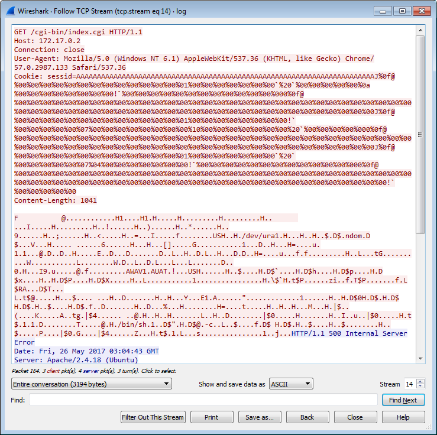
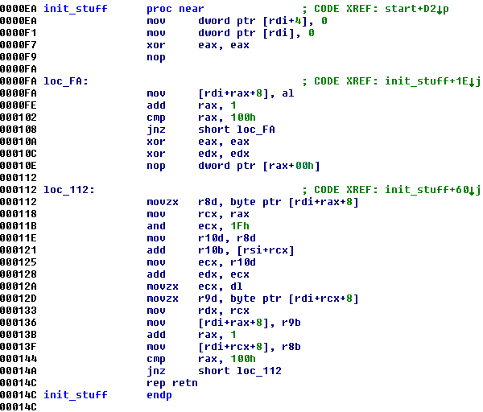

# Incident Response - Misc - 267 points - 29 teams solved

> We found some strange activities on our web server.
> Can you find out what happened?
>
> [incident_response.tgz](./incident_response.tgz-66e6ba124d2396c32010104ce20ea182de8859c704895750d3ea994068add833)

In this challenge we are given a .pcap network capture file, so we load it up in Wireshark. At first glance it's a lot of HTTP traffic, but right in the middle there's some strange TCP traffic going over port 31337. Sounds like something worth investigating.

Looking at the surrounding traffic, we soon see a very strange and suspicious HTTP request - the "AAAAAAAAAAAAAAAAAAAA" line instantly makes us think of a buffer overflow exploit.

We crop out the HTTP body and save it to a separate file, then load the file up in IDA, guessing that it's simple x86 code. We start mashing 'C' to try converting data to code, and soon find a block of syscall wrapper functions.

`syscall`? Not `int 0x80`?

...We reload the file as **x64** code, then do the same process.

The initial analysis shows that the code calls `fork()`, then in the child process connects to the IP address we saw in the packet capture. It calls a function at `0x009A` which reads 32 bytes from `/dev/urandom`, and sends it over the connection, then calls the function at `0x00EA`.

This function clears two values, then sets up a 256 byte table containing the values 0-255, and uses the previous 32 random bytes to shuffle them around. This sounds almost exactly like the [RC4 encryption algorithm](https://en.wikipedia.org/wiki/RC4) initialization, so on a hunch we code a simple decryption script. We take the 32 first bytes in the TCP stream as the key, then try to decrypt the rest of the stream as RC4.

This works perfectly, and the decrypted data turns out to be a shell session, where the user eventually grabs the content of the flag file - `CBCTF{7RAcKINg_H4ckERs_f00tPrINTs_i5_excItING}`
