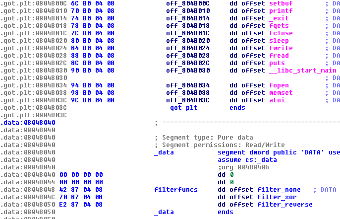

# Secret Mailer Service - Exploitation - 256 points - 32 teams solved

> nc sms.tasks.ctf.codeblue.jp 6029
>
> [secret_mailer_service.tgz](./secret_mailer_service.tgz-47398016b8bf5679acfaa552e0f7cc37229d3d1b8aa45d22f866d3b347347817)

This x86 binary allows you to write, delete or "post" notes. The structure of the notes is this:

    00000000 postentry       struc ; (sizeof=0x108, mappedto_2)
    00000000 in_use          dd ?
    00000004 size            dd ?
    00000008 data            db 256 dup(?)
    00000108 postentry       ends
    
Since there are max 5 entries, and they are all preallocated on the stack, there's no `malloc`/`free` to exploit. When "post"ing a note, you pick from a list of filters, which then the note is sent through before being written to `/dev/null`. The vulnerability here is that the filter list is implemented as a jump table, and uses a signed compare so you are allowed to use negative indexes.

The GOT entries are right below the jump table, so you can easily call any of them. The only problem is finding something that can do something useful with the function arguments. The filter function signature is `filter(FILE* output, char* buffer, int buffersize)`. Our first idea is some form of `FILE*` structure corruption, but none of the functions seem to be able to write into the structure.

We finally realize we can use `setbuf()` to set the buffer of `/dev/null` to one of the post structure entries on the stack. Since each post is 264 bytes in size, and the default buffer size for libc is 8192 bytes, we can "post" notes until the buffer overwrites another entry, and can then rewrite the size of a post entry. We can then "post" an oversized note with XOR encryption to overwrite into the stack. (After the contest was over, we realized that we could just do this in one stage by continuing posting past the end of the post structures, which would probably be easier)

We prepare a ROP chain that leaks a libc address, then reads back an address which overwrites `atoi()` in the GOT with the address of `system()`. Since organizers have provided us with the `libc.so.6` from the system we don't have to do any further leaks, and can simply run `/bin/sh`. With shell access we find the flag, `CBCTF{4R3_YOU_w4RM3D_UP_f0R_MORE_PWNabLeS?}`
