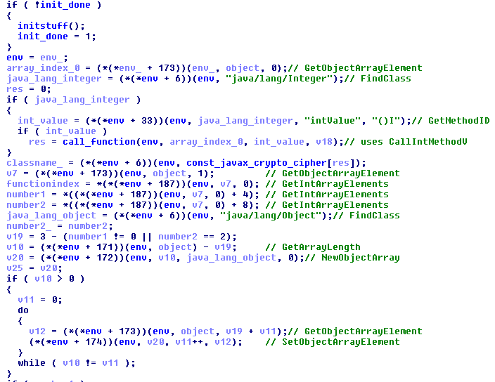

# Shall We Play A Game? - Reversing - 113 points - 111 teams solved

> Win the game 1,000,000 times to get the flag.
>
> [Attachment](./d885dfc8bec65e85c139046cdfa4c7e771ea443e35697b47423321be0e6f7331.zip)

This is an Android game where you have to win at Tic-Tac-Toe one million times to get the flag. The "easy" way
that a lot of other teams have used involves patching the game to auto-win the game and remove animations so it
happens very quickly. But I don't have any experience with modifying APKs, so I decided to do it the "hard"
way.

First, because I'm too lazy to have Java installed, I use
[an online APK decompiler](http://www.javadecompilers.com/apk) to get the decompiled source. There's a native
library included, so I load the x86 library into IDA to take a look. The first thing I notice is a 
deobfuscating function at `0x5a0`, so I recreate the deobfuscation in a
[Python script](./deobfuscatelibrary.py) and see that the obfuscated data was a number of Java class and
function names:

    0 'javax/crypto/Cipher\x00'
    1 'javax/crypto/spec/SecretKeySpec\x00'
    2 'java/security/MessageDigest\x00'
    3 'java/util/Random\x00'
    4 'getInstance\x00'
    5 '<init>\x00'
    6 'init\x00'
    7 'doFinal\x00'
    8 'getInstance\x00'
    9 'update\x00'
    10 'digest\x00'
    11 '<init>\x00'
    12 'nextBytes\x00'
    13 '(Ljava/lang/String;)Ljavax/crypto/Cipher;\x00'
    14 '([BLjava/lang/String;)V\x00'
    15 '(ILjava/security/Key;)V\x00'
    16 '([B)[B\x00'
    17 '(Ljava/lang/String;)Ljava/security/MessageDigest;\x00'
    18 '([B)V\x00'
    19 '()[B\x00'
    20 '(J)V\x00'
    21 '([B)V\x00'
    22 'AES/ECB/NoPadding\x00'
    23 'AES\x00'
    24 'SHA-256\x00'

I take a look at the decompiled Java code, and I see quite a few calls to `C0644N.m3217_` which seems to be the
function that's implemented in the native library. The first parameter to the call is an integer between 0 and
3, the second parameter is one of these length 3 arrays:

    static final int[] f2334a = new int[]{0, 1, 0};
    static final int[] f2335b = new int[]{1, 0, 2};
    static final int[] f2336c = new int[]{2, 0, 1};
    static final int[] f2337d = new int[]{3, 0, 0};
    static final int[] f2338e = new int[]{4, 1, 0};
    static final int[] f2339f = new int[]{5, 0, 1};
    static final int[] f2340g = new int[]{6, 0, 0};
    static final int[] f2341h = new int[]{7, 0, 2};
    static final int[] f2342i = new int[]{8, 0, 1};

I return to the native code, and see that it does a lot of calls to a function table sent in as `argv[0]`.
Looking up how Java does interfacing with native code, I see that this argument is a reference to the
[JNINativeInterface class](https://github.com/jnr/jnr-ffi/blob/master/src/main/java/jnr/ffi/provider/jffi/JNINativeInterface.java) -
with the indexes known, I could start naming function calls inside the decompiled functions, and a pattern
started to emerge.

The first parameter, the integer (between 0 and 3) in the function call is the class index, one of these:

    0 'javax/crypto/Cipher\x00'
    1 'javax/crypto/spec/SecretKeySpec\x00'
    2 'java/security/MessageDigest\x00'
    3 'java/util/Random\x00'

The first integer in the array passed as the second parameter is the method index, with these names and
parameter definitions:

    0 'getInstance\x00'
    1 '<init>\x00'
    2 'init\x00'
    3 'doFinal\x00'
    4 'getInstance\x00'
    5 'update\x00'
    6 'digest\x00'
    7 '<init>\x00'
    8 'nextBytes\x00'

    0 '(Ljava/lang/String;)Ljavax/crypto/Cipher;\x00'
    1 '([BLjava/lang/String;)V\x00'
    2 '(ILjava/security/Key;)V\x00'
    3 '([B)[B\x00'
    4 '(Ljava/lang/String;)Ljava/security/MessageDigest;\x00'
    5 '([B)V\x00'
    6 '()[B\x00'
    7 '(J)V\x00'
    8 '([B)V\x00'

I didn't fully work out all the details for the second and third integer in the arrays, but I assume they are
static/class flags and number of paramters.

Given all this, I started piecing together what happens in the GameActivity code:

- On construction of GameActivity, a new `java.util.Random()` is created with a fixed PRNG seed
- Then a 32-byte array `f2332q` is filled with 32 PRNG bytes with `nextBytes()`
- For every win, the SHA256 hash of that array is replaced with its own hash
- After one million wins, the `f2332q` array is used as a key to AES decrypt the `f2333r` array in ECB mode
- The result is displayed as the flag

Since the Java PRNG is [well documented](https://docs.oracle.com/javase/7/docs/api/java/util/Random.html#setSeed(long))
and relatively simple, I just re-implemented all of the above in another [Python script](./solution.py) and ran
it to get the final flag, `CTF{ThLssOfInncncIsThPrcOfAppls}`
