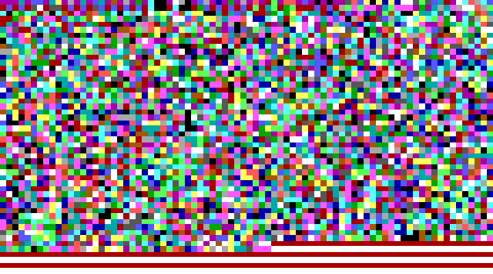

# vga - Reversing - 150+100 points - 3 teams solved

> mov ebp,0xb8000;jmp ebp
>
> ### Download:
> [55d631ee31fa11a5f6784ccbed1709a3e4ab834b2c09bd2ad6dd24ebfc1db88d.tar.xz](./55d631ee31fa11a5f6784ccbed1709a3e4ab834b2c09bd2ad6dd24ebfc1db88d.tar.xz)

The challenge file contains a 720x400 size image:

This is actually a screenshot of a [VGA text mode screen](https://en.wikipedia.org/wiki/VGA-compatible_text_mode#PC_common_text_modes) - 80x25 characters, with each character being 9x16 pixels in size. Every character onscreen is [Extended ASCII character 223](http://www.theasciicode.com.ar/extended-ascii-code/top-half-block-ascii-code-223.html), which means the top half of each character box is in foreground color, while the bottom half is in background color.

The [memory layout](https://en.wikipedia.org/wiki/VGA-compatible_text_mode#Text_buffer) shows that each character is a 16-bit halfword, with the lower 8 bits as the ASCII code, bits 8-11 as the foreground color and bits 12-15 as the background color. So for example, the first character would have the code `0x45DF` since red = 4 and purple = 5, and in memory this becomes `0xDF 0x45` due to endianness.

We decode the rest of the colors in the image in the same way, and get a 4000 byte program. We then create a small loader program that puts the program at memory location `0xb8000` and loads it into `gdb`. Single stepping through, we see that the program "decrypts" its second part, and this second part checks a flag stored at `esp`.

Because we are lazy, we create a small [Angr](http://angr.io/) script that finds a way to reach the last instruction of the code, and after a few minutes it dumps out the flag `hxp{0k_YoU_aPp4rEntlY_KnOw_VG4_W3l1_En0UGh}`.
