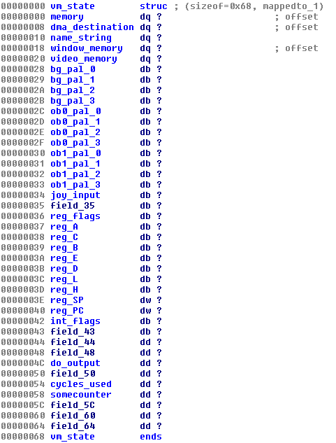
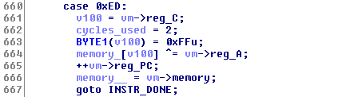
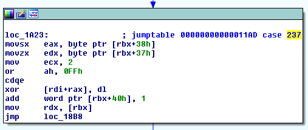

# gameboy - Exploitation - 450 points

> Whatever happened to the good old days when we played on our [Gameboys](./gameboy_c7a4e5cde2194af9b66aa5fbc724c785.tar.gz)
> instead of doing this hacking stuff? ...I guess in retrospect not a whole lot has changed. 
>
> Running at `gameboy.chal.pwning.xxx:30908`

This challenge contained a basic Gameboy emulator and a Gameboy ROM file. We never found any use for the ROM file, so I
guess it was just included as an example - it seems to be a simple homebrew game.

The emulator is tiny, and lacks some vital features like sprites and sound, but it's feature complete enough to show the
Tetris title screen when loading the official ROM. It outputs to the console using Braille unicode letters to simulate the
LCD screen.

First, we needed a refresher in how a Gameboy actually works, so we found a few links to help us understand what the
emulator was doing:

[The The Ultimate Game Boy Talk from 33C3](https://www.youtube.com/watch?v=HyzD8pNlpwI) - you should really watch this!

[Gameboy Memory Map](http://gameboy.mongenel.com/dmg/asmmemmap.html)

[Everything You Always Wanted To Know About GAMEBOY](http://bgb.bircd.org/pandocs.htm)

[Gameboy Opcode Matrix](http://pastraiser.com/cpu/gameboy/gameboy_opcodes.html)

With this, we started to decompile the emulator piece by piece. The most important element of the emulator is the Virtual
Machine State struct, shown below:

This struct is allocated as the first thing on the heap, immediately followed by the 64KB RAM/ROM area of the GB virtual
machine, video memory and temporary loading area for the ROM. The memory layout is this (malloc metadata excluded):

    heapbase+0x000010-heapbase+0x000078 size 0x000068  VM state
    heapbase+0x000080-heapbase+0x010082 size 0x010002  VM memory
    heapbase+0x010090-heapbase+0x015a90 size 0x005a00  video memory 1
    heapbase+0x015aa0-heapbase+0x025aa0 size 0x010000  video memory 2
    heapbase+0x025ab0-heapbase+0x02dab0 size 0x008000  temporary ROM storage - free()d before emulation start
    
We spent a lot of time looking for implementation errors, but everything seemed pretty robust and there was no obvious
flaws. But then, we noticed that there was code for handling opcode `0xED` which is *not* part of the Gameboy CPU spec.
The code seemed pretty straightforward at first glance:

It simply XORs the content of VM memory address `0xff00+reg_C` with the content of register A. Doesn't seem
exploitable.

Oooooor....

This is the disassembly of the same function. Notice how it uses **movsx** - the offset `reg_C` will actually be sign
extended! This means we can actually modify memory right before the VM memory area too - right where the VM state is!
(`BYTE1(v100) = 0xFFu;` doesn't matter because any negative offset will already have 0xFF in that position)

What we did with this was load 0x80 into `reg_A` and 0x90 == -0x70 into `reg_C`, then use the bad opcode. This modified the
`vm->memory` pointer into pointing at `heapbase+0x000000` instead, shifting the full VM state structure into the Gameboy's
memory space, giving us full read/write access to the state via GB code.

But how can we extend this to arbitrary read/write anywhere in memory? When we trigger the bad opcode, the instruction
pointer of the VM suddenly shifts, which isn't a big problem with our first stage, because the new VM instruction pointer
(called PC, Program Counter in the GB spec) is still inside our ROM data, but changing the memory pointer to somewhere else,
like inside libc, or the stack, means the VM is suddenly executing random data as Gameboy code!

Thankfully, the Gameboy has a thing called DMA transfer - if you write a byte ZZ into the memory address `0xff46`, the
Gameboy CPU will copy 160 bytes starting at `0xZZ00` into the memory at `0xfe00`. In this emulator, the DMA transfer will
actually go to `vm->dma_destination`, which is initially set to where `0xfe00` is in VM memory. Since we can rewrite the VM
state, we can change this destination and get arbitrary write anywhere - meaning we could write GB code to the destination
before we do a "context pivot" by changing `vm->memory`.

We then set up a slightly complicated chain of code to leak memory, but also return control back to the original GB code in
the heap:

 - copy VM state structure and a small GB code stub from `0x0010`-`0x0100` to `0xD000`
 - change `vm->reg_PC` in the copied structure, point it to the code to resume *after* the leak, for example `0x0200`
 - change `vm->dma_destination` *in the active VM state* to our leak target+`0x10`
 - trigger DMA copy -- copies the cloned vm state from `0xd000` to leak target+`0x10`
 - change `vm->dma_destination` in the copied structure so it points to the start of the heap
 - change `vm->reg_PC` in the copied structure again, point it to `0xfe80`
 - change `vm->memory` in the copied structure, point it to leak target-`0xfe10`
 - change `vm->dma_destination` *in the active VM state* to point to the active VM state itself
 - trigger DMA copy -- copies the cloned vm state from `0xd000` to the active VM state, triggering a context pivot

 
After the pivot, the memory layout as seen from the GB CPU is this:

    0x0000-0xfe00  area before the data we want to leak, not used or addressed by the CPU
    0xfe00-0xfe10  data we want to leak
    0xfe10-0xfe80  copy of VM state, contains the original `vm->memory`
    0xfe80-0xfeb0  code stub to trigger another context pivot, GB CPU starts here after pivot
    0xff00-0xffff  various I/O registers for the GB, *will be corrupted* when the VM is running
    
Since we set the DMA destination to the start of the heap before doing this pivot, it is now possible for the code stub to
do *another* pivot, transferring the memory at `0xfe00-0xfea0` back to the start of the heap. This means the VM state is
restored to what it was before we started the leak process, with only `vm->reg_PC` changed - but also, the memory at
`heapbase+0x000000` now contains 16 bytes of leaked data, which is visible to the GB CPU!

We first used this process to leak the data at `heapbase+0x025ab0` - since `free()` was used on this memory, it now
contained a pointer to the `main_arena` struct in libc. We used this to calculate the libc base address, then from the base
knew the position of the `environ` pointer in libc, which points into environment variable array on the stack. This was the
second address we leaked.

With the libc base known, and the env position on the stack known, we could do another custom DMA transfer, overwriting the
return
address of `main()` with a [single-gadget ROP into /bin/sh](https://kimiyuki.net/blog/2016/09/16/one-gadget-rce-ubuntu-1604/),
then we executed an invalid opcode, which made the emulator return from `main()`, giving us shell access.

We found the flag file at `/home/gameboy/flag`, and finally got the flag: 
`PCTF{gameboy?_thats_sexist_why_isnt_it_just_gamechild?}`

(During this exploitation we also had to create some way to get memory content back from the remote system - this hasn't
been detailed since it doesn't involve any exploits, just encoding data, putting it on the GB screen then scraping it -
this is left as an exercise for the reader)
