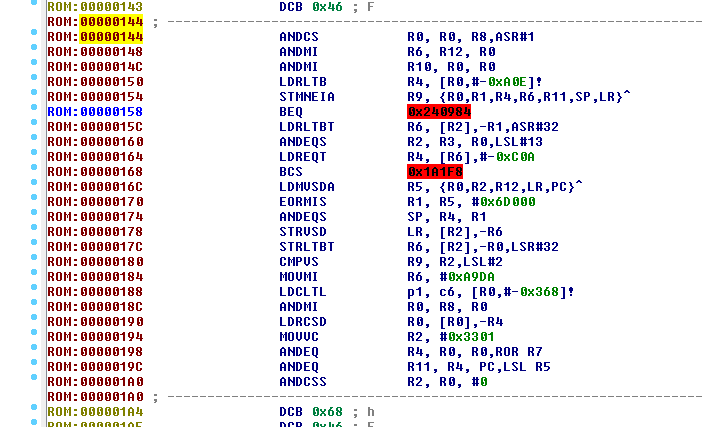
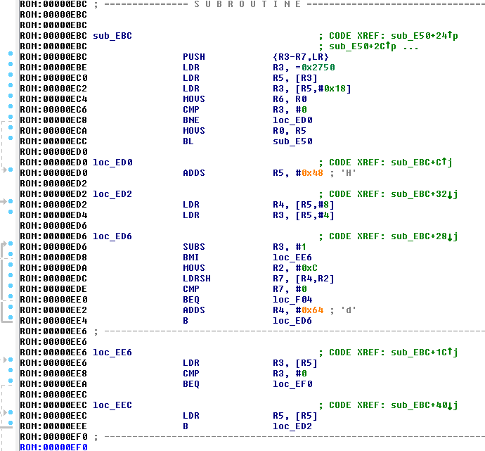
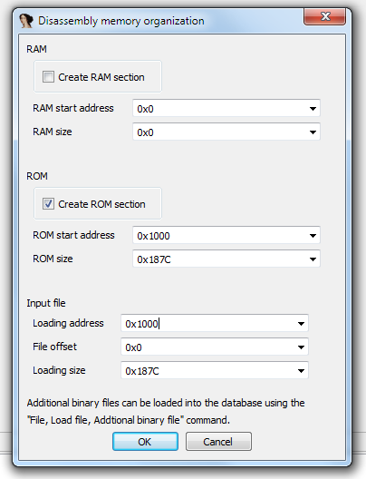
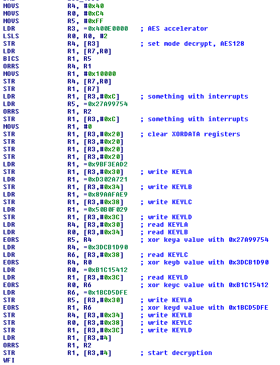

# Dumpster dive - Reversing - 100 points

> Crash Override extracted this binary from a broken device we found when dumpster diving on Ellingson Mineral Company. The device contained a EFM32HG322F64G microcontroller and a SSD1306 display. Can you help us find out what it does?
>
> Solves: 6
>
> Download: [http://dl.ctf.rocks/dumpster_diving.tar.gz](./dumpster_diving.tar.gz)
>
> Author: SecureLink / klondike

We are given a flat binary file and the above description. After a bit of Google use we found the [reference manual](https://www.silabs.com/documents/public/reference-manuals/EFM32G-RM.pdf) for the microcontroller family. It is an ARM Cortex-M3 system, so we open binary up in IDA - set processor type to ARM and load it. Since it's a flat binary, there is no metadata to tell us where the entry point is, so we just start randomly converting to code by pressing "C" at various offsets.

That didn't work so well. Let's try again, but this time, we press Alt-G and set the `T` register to 1 to switch to Thumb mode before converting to code.

That seems much better. Some offsets still seem misaligned though, so we do a final reload of the binary file, this time guessing it should be at address `0x1000`:

We do a quick browsing of the program, and notice a few things:

* Addresses `0x000011C8` and `0x000023C0` contain pseudorandom data, maybe encrypted data?
* Code at address `0x00001638` loads and EORs various strange values, maybe a key?
* Code at address `0x00001622` uses `0x400E0000` as an offset to read/write some data

Reading the reference manual, we find that `0x400E0000` is the memory area for the [AES](https://en.wikipedia.org/wiki/Advanced_Encryption_Standard) accelerator. We start commenting what happens in the code, and end up with something like this:

It seems like maybe the final key is an XOR between two different keys. On a hunch, we start decrypting the data parts we noticed earlier with this key, ECB mode at first since we don't see any more advanced code.

And we get a partial flag out of decrypting `0x000023C0`! Continuing decrypting in ECB mode gives us the full flag: `SECT{0MG!_N035!_U_8R0K3_MY_53C0ND_F4C70R_4U7H3N71C4T10N!}`
